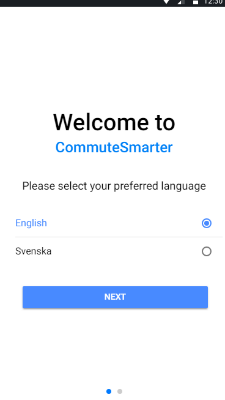
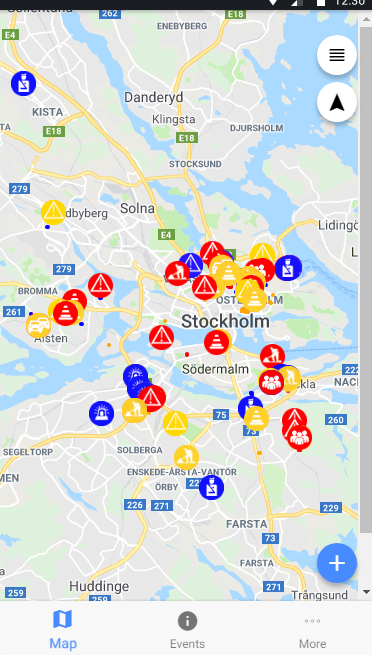
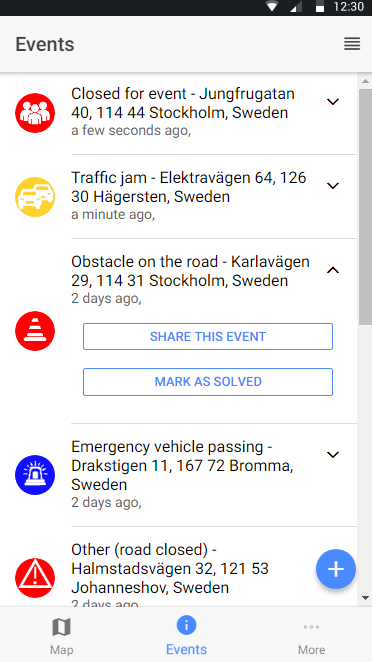
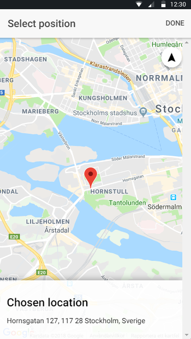

# CommuteSmarter
A hybrid application that allows for Stockholm's citizens to commute smarter. 
Developed in cooperation with Stockholm City and Stockholm's Öppna Data. 
Push-notifications support for nearby events when running on Android.

### Client-side technologies
Ionic, Cordova, Angular, SQLite, SASS and TypeScript.

### Server-side technologies
Node (Express), Sequelize as ORM (SQLite & MySQL), Heroku for deployment. 

### APIs

Twitter for user authentication/handling.
Google Maps for event visualization.
Google's Directions Service for reverse geo-lookup and path generation.

### Application overview
  
 
